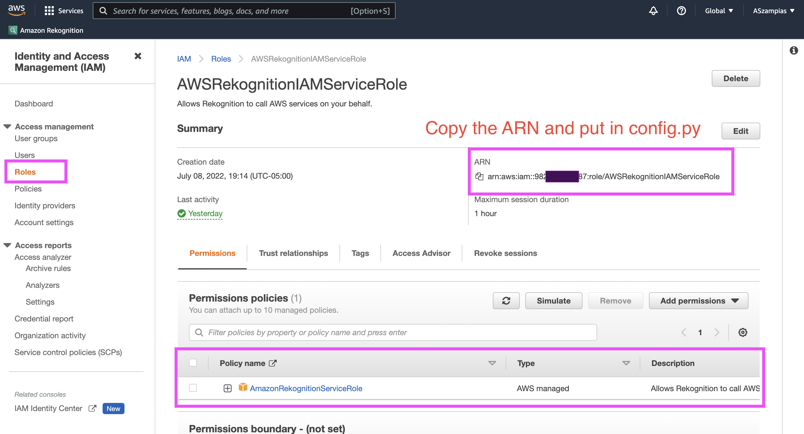
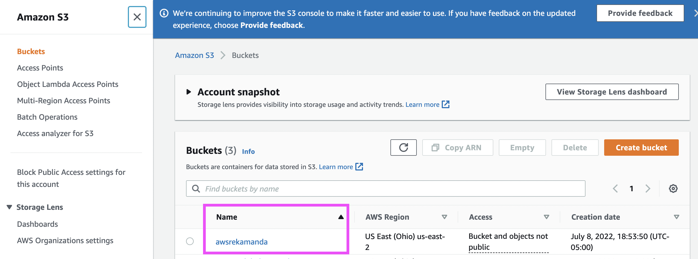
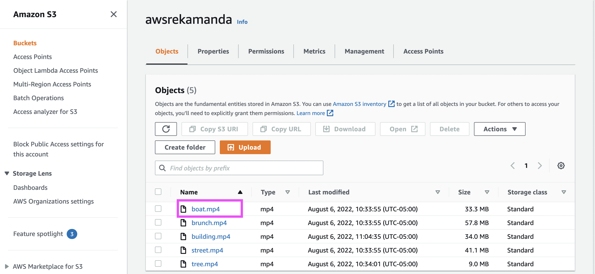
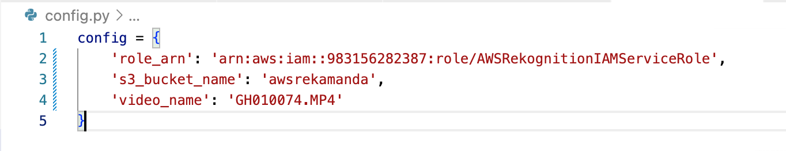
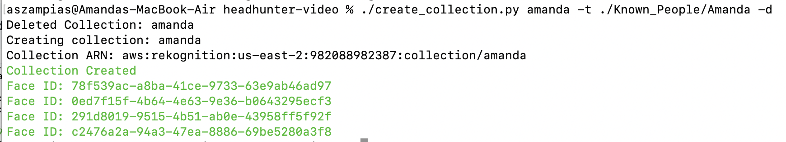
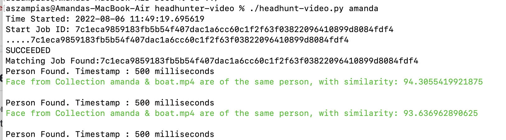
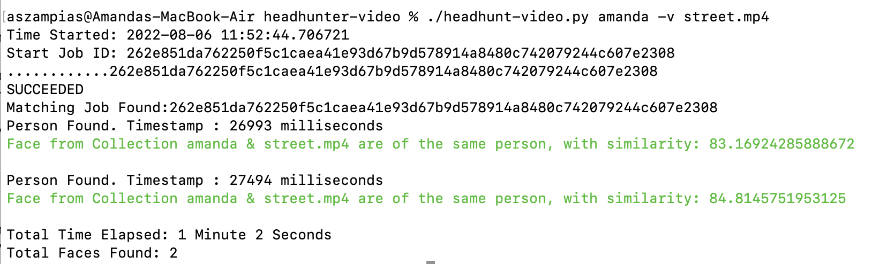

# headhunter-video
Find people in face masks, sunglasses, low quality images, hats, and different hair styles using AWS Rekognition. HeadHunter takes a collection of images and identifies the faces in a video.

## Steps
1. Install the python libraries using pip3:
<pre>
pip3 install -r requirements.txt
</pre>

2. Give permissions to the scripts for Linux:
<pre>
chmod +x create_collection.py
chmod +x headhunt-video.py
</pre>

3. Go to IAM -> Roles. Make an AWSRekognitionIAMServiceRole. Scroll to the very end for directions in this link: <a href="https://docs.aws.amazon.com/rekognition/latest/dg/api-video-roles.html" target="_blank">api-video-roles.html</a>
<kbd>
  
</kbd>
  

4. Make an S3 Bucket. Note the name of the bucket. Put bucket name in config.py as-is.

<kbd>
  
</kbd>
  

5. Upload video. Note the video name you'd like to run facial rekognition on. Put video name in config.py as-is.

<kbd>
  
</kbd>
  

6. config.py should look something like this. With the values replaced with your specific ARN, S3 Bucket Name, and Video Name.

<kbd>
  
</kbd>

## Running The Program

Create a collection first. A collection is one image or a set of images. We will use my face as an example. Note: Only use -d (delete) if a collection has already been created.

<pre>./create_collection.py amanda -t ./Known_People/Amanda</pre>
<kbd>
  
</kbd>

### Example 1: Using the config.py Video Name

Run headhunt-video.py amanda. The config.py file is set to the video boat.mp4

<pre>./headhunt-video.py amanda</pre>
<kbd>
  
</kbd>

### Example 2: Specifying Video Name using -v

The config.py video name doesn't need to be used. Use the -v key if you want to specify the video name within the command line.

<kbd>
  
</kbd>

## Video Type Allowed in S3 Bucket ##

Q: What video formats does Amazon Rekognition support? 

Amazon Rekognition Video operations can analyze videos stored in Amazon S3 buckets. The video must be encoded using the H.264 codec. The supported file formats are MPEG-4 and MOV. A codec is software or hardware that compresses data for faster delivery and decompresses received data into its original form. The H.264 codec is commonly used for the recording, compression and distribution of video content. A video file format may contain one or more codecs. If your MOV or MPEG-4 format video file does not work with Rekognition Video, check that the codec used to encode the video is H.264.

## Operating Systems
This script is supported on Windows, Linux, and MacOS.

## Demo Videos

Still Picture Example using a Yearbook.

Moving Person Example

## 🚨 🚓 Amazon Policy Towards Police and Law Enforcement: Positive 🚓 🚨

If you are in law enforcement, Amazon (at least July 2022) has a positive view regarding police using its FacialRekognition technology. Keep up to date as these companies can change their minds. 

https://docs.aws.amazon.com/rekognition/latest/dg/considerations-public-safety-use-cases.html 
https://aws.amazon.com/rekognition/the-facts-on-facial-recognition-with-artificial-intelligence/ 
https://aws.amazon.com/blogs/machine-learning/marinus-analytics-fights-human-trafficking-using-amazon-rekognition/ 
https://aws.amazon.com/stateandlocal/justice-and-public-safety/ 
